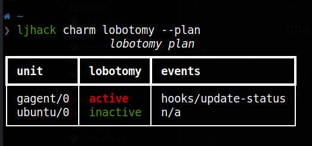

# jhack - Make charming charming again!

[](https://snapcraft.io/jhack) [](https://github.com/PietroPasotti/jhack) [](https://discourse.charmhub.io/t/visualizing-relation-databags-for-development-and-debugging/5991)


This is a homegrown collection of opinionated scripts and utilities to make the
charm dev's life somewhat easier.

This README is meant as overview of what's there, and high-level documentation of the commands.
More extensive documentation is provided in the cli itself. All commands can be called with `--help` and will provide more information than what is included here.

#### Installation:
##### from sources (dev setup):
Clone the repo

```shell
pip install -r requirements.txt
pip install -e .
```

##### as package (requires setuptools 61 or later):

```shell
pip install git+https://github.com/PietroPasotti/jhack
```

##### as snap:

```shell
sudo snap install --edge jhack
sudo snap connect jhack:dot-local-share-juju snapd
sudo snap connect jhack:ssh-read snapd
```

The last binding is only necessary if you work on LXD models and use commands that rely on `juju ssh/juju scp`.

#### Usage:

```shell
jhack [category] [command]
```

for example:

```shell
jhack utils tail
jhack model rm
```


#### Building:

`pip install build`

`python -m build`

Happy hacking!


# Disclaimer

Many of the commands jhack offers are pretty destructive or bring a high risk of catastrophic failure and random explosions.

These commands will prompt the user for confirmation before proceeding, after, whenever possible, showing the low-level (Juju) commands it would run.

## Enabling devmode

You can permanently enable devmode by setting `~/.config/jhack/config.toml` (see `jhack conf`) and set `[general]enable_destructive_commands_NO_PRODUCTION_zero_guarantees` to `true`.

Otherwise, set the `JHACK_PROFILE=devmode` envvar to run a single command without the confirmation prompt. 

As only exception, nuke has a double safeguard in that even if you enable devmode, you will still get a confirmation prompt.
To disable that one, set `[nuke]ask_for_confirmation` to `false`.


# utils
## sync

`jhack utils sync application-name/0 -s ./src -s ./lib`

Will watch the `./src` and `./lib` folders (recursively, by default) for changes and push any to the `application-name/0` unit.

Pro tip: `jhack utils sync application-name -s ./src` will sync to all units of `application-name`!

Pro-pro tip: `jhack sync * -s ./lib` will sync to all applications in the current model! Handy when you're working on shared (relation interface, for example) libraries.

## unbork-juju

`jhack utils unbork-juju`

Does exactly what it says, and it does it pretty well.

## ffwd

`jhack utils ffwd`

Fast-forwards the firing of `update-status` hooks, and restores it to a 'slow' firing rate after the process is killed or after a given timeout.

Self-explanation:
```bash
jhack utils ffwd
  --timeout 10 # exits after 10 seconds
  --fast-interval 5 # update-status fires each 5 seconds
  --slow-interval 50m # when done, set update-status firing rate to 50 minutes.
  ```


## tail

Monitors the logs and gathers all logs concerning events being fired on the units.
Will pprint the last N in a nice format. Keeps listening and updates in the
background as new units are added.

```
┏━━━━━━━━━━━┳━━━━━━━━━━━━━━━━━━━━━━━━━━━━━━┳━━━━━━━━━━━━━━━━━━━━━━━━━━━━━━┓
┃ timestamp ┃ traefik-k8s/0                ┃ prometheus-k8s/1             ┃
┡━━━━━━━━━━━╇━━━━━━━━━━━━━━━━━━━━━━━━━━━━━━╇━━━━━━━━━━━━━━━━━━━━━━━━━━━━━━┩
│ 13:37:15  │                              │ ingress-relation-changed     │
│ 13:37:14  │                              │ ingress-relation-joined      │
│ 13:37:14  │                              │ ingress-relation-changed     │
│ 13:37:13  │                              │ prometheus-peers-relation-c… │
│ 13:37:12  │                              │ prometheus-peers-relation-j… │
│ 13:37:12  │                              │ prometheus-pebble-ready      │
│ 13:37:11  │                              │ start                        │
│ 13:37:10  │                              │ config-changed               │
│ 13:37:09  │                              │                              │
│ 13:37:09  │                              │ database-storage-attached    │
│ 13:37:09  │ ingress-per-unit-relation-c… │                              │
│ 13:37:08  │                              │ leader-settings-changed      │
│ 13:37:08  │ ingress-per-unit-relation-c… │                              │
│ 13:37:08  │                              │                              │
│ 13:37:08  │                              │ ingress-relation-created     │
│ 13:37:07  │ ingress-per-unit-relation-j… │                              │
│ 13:37:07  │                              │                              │
│ 13:37:07  │                              │ prometheus-peers-relation-c… │
│ 13:37:06  │                              │ install                      │
└───────────┴──────────────────────────────┴──────────────────────────────┘
```

### There's more!
You can use `tail` to visualize deferrals in `ops`.

If you pass the `-d` flag, short for `--show-defer`, whenever an event is deferred, reemitted, or re-deferred, you'll be able to follow it right along the tail.
You might see then something like:
```text
┏━━━━━━━━━━━━━━━━━━━━━━━━━━┳━━━━━━━━━━━━━━━━━━━━━━━━━━━━━━━━━━━━━━━┓
┃ timestamp                ┃ trfk/0                                ┃
┡━━━━━━━━━━━━━━━━━━━━━━━━━━╇━━━━━━━━━━━━━━━━━━━━━━━━━━━━━━━━━━━━━━━┩
│ 14:02:53                 │                                     │ │
│ 14:01:36                 │ event_3                           ❯─┘ │
│ 13:56:49                 │ ingress_per_unit_relation_changed     │
│ 13:56:47                 │ ingress_per_unit_relation_changed     │
│ 13:56:47                 │ ingress_per_unit_relation_changed     │
│ 13:56:46                 │ ingress_per_unit_relation_joined      │
│ 13:56:46                 │ event_3                           ❮─┐ │
│ 13:56:46                 │ ingress_per_unit_relation_created   │ │
│ 13:46:30                 │ event_3                            ⭘┤ │
│ 13:41:51                 │ event_3                           ❯─┘ │
│ 13:41:51                 │ event_2                           ❮─┐ │
│ 13:36:50                 │ event_2                           ❯─┘ │
│ 13:36:50                 │ event_1                           ❮─┐ │
│ 13:31:29                 │ event_1                           ❯─┘ │

                            [...]
```

The little circle is `event-3` getting re-emitted and immediately re-deferred!

The graph can get nice and messy if multiple events get deferred in an interleaved fashion, enabling you to *see* what's going on. Which is nice.

```text
update_status ❮──────┐
update_status   .....│
update_status  ⭘─────┤
update_status   .....│
update_status  ⭘─────┤
update_status ❮─────┐│
update_status ❯─────┼┘
update_status  ⭘────┤
update_status ❮────┐│
update_status ❯────┼┘
update_status ❮────┼┐
update_status  ⭘───┤│
update_status ❯────┼┘
update_status  ⭘───┤
update_status ❮───┐│
update_status ❮──┐││
update_status ❯──┼┼┘
update_status  ⭘─┼┤
update_status  ⭘─┤│
update_status ❯──┼┘
```

And did I mention that there's **colors**?

### You can also `tail` saved logs

Say you have saved two debug-logs with:

```
juju debug-log --date -i prom/0 > prom.log
juju debug-log --date -i trfk/0 > trfk.log
```

Yielding files:

prom.txt
```
unit-prom-0: 2022-07-20 10:00:00 INFO juju.worker.uniter.operation ran "install" hook (via hook dispatching script: dispatch)
unit-prom-0: 2022-07-21 5:00:00 INFO juju.worker.uniter.operation ran "prometheus-peers-relation-created" hook (via hook dispatching script: dispatch)
```

trfk.txt
```
unit-trfk-0: 2022-07-20 11:00:00 INFO juju.worker.uniter.operation ran "start" hook (via hook dispatching script: dispatch)
unit-trfk-0: 2022-07-20 12:00:00 INFO juju.worker.uniter.operation ran "traefik-pebble-ready" hook (via hook dispatching script: dispatch)
```

You can run `jhack utils tail --file=prom.txt --file=trfk.txt` to see the events in all the logs, interlaced in the correct chronological order as expected:

```
┏━━━━━━━━━━━━━━━━┳━━━━━━━━━━━━━━━━━━━━━━━━━━━━━━━━━━━━━━┳━━━━━━━━━━━━━━━━━━━━━━━━━┓
┃ timestamp      ┃ prom/0                               ┃ trfk/0                  ┃
┡━━━━━━━━━━━━━━━━╇━━━━━━━━━━━━━━━━━━━━━━━━━━━━━━━━━━━━━━╇━━━━━━━━━━━━━━━━━━━━━━━━━┩
│  5:00:00       │ prometheus_peers_relation_created    │                         │
│ 12:00:00       │                                      │ traefik_pebble_ready    │
│ 11:00:00       │                                      │ start                   │
│ 10:00:00       │ install                              │                         │
├────────────────┼──────────────────────────────────────┼─────────────────────────┤
│ The end.       │ prom/0                               │ trfk/0                  │
├────────────────┼──────────────────────────────────────┼─────────────────────────┤
│ events emitted │ 2                                    │ 2                       │
└────────────────┴──────────────────────────────────────┴─────────────────────────┘
```


## show-relation

Displays the databags of units involved in a relation.
if the endpoint is of the form `app-name/id:relation-name`: it will display the application databag and the one for the unit with id=`id`.
If the endpoint is of the form `app-name:relation-name`: it will display the application databag and the databags for all units.
Examples:

`jhack utils show-relation ipu:ingress-per-unit traefik-k8s:ingress-per-unit`

`jhack utils show-relation ipu/0:ingress-per-unit traefik-k8s:ingress-per-unit`

`jhack utils show-relation ipu/0:ingress-per-unit traefik-k8s/2:ingress-per-unit`

Example output:
```bash
                                                      relation data v0.2
┏━━━━━━━━━━━━━━━━━━┳━━━━━━━━━━━━━━━━━━━━━━━━━━━━━━━━━━━━━━━━━━━━━━━━━━━━━┳━━━━━━━━━━━━━━━━━━━━━━━━━━━━━━━━━━━━━━━━━━━━━━━━━━━━┓
┃ category         ┃ traefik-k8s                                         ┃ ipu                                                ┃
┡━━━━━━━━━━━━━━━━━━╇━━━━━━━━━━━━━━━━━━━━━━━━━━━━━━━━━━━━━━━━━━━━━━━━━━━━━╇━━━━━━━━━━━━━━━━━━━━━━━━━━━━━━━━━━━━━━━━━━━━━━━━━━━━┩
│ relation name    │ ingress-per-unit                                    │ ingress-per-unit                                   │
│ interface        │ ingress_per_unit                                    │ ingress_per_unit                                   │
│ leader unit      │ 0                                                   │ 0                                                  │
├──────────────────┼─────────────────────────────────────────────────────┼────────────────────────────────────────────────────┤
│ application data │ ╭─────────────────────────────────────────────────╮ │ ╭────────────────────────────────────────────────╮ │
│                  │ │                                                 │ │ │ <empty>                                        │ │
│                  │ │  ingress  ipu/0:                                │ │ ╰────────────────────────────────────────────────╯ │
│                  │ │             url:                                │ │                                                    │
│                  │ │           http://my.it:80/test-charm-ipu-9dg8…  │ │                                                    │
│                  │ │           ipu/1:                                │ │                                                    │
│                  │ │             url:                                │ │                                                    │
│                  │ │           http://my.it:80/test-charm-ipu-9dg8…  │ │                                                    │
│                  │ │           ipu/2:                                │ │                                                    │
│                  │ │             url:                                │ │                                                    │
│                  │ │           http://my.it:80/test-charm-ipu-9dg8…  │ │                                                    │
│                  │ ╰─────────────────────────────────────────────────╯ │                                                    │
│ unit data        │ ╭─ traefik-k8s/0* ─╮ ╭─ traefik-k8s/1 ─╮            │ ╭─ ipu/0*  ────────────────────╮                   │
│                  │ │ <empty>          │ │ <empty>         │            │ │                              │                   │
│                  │ ╰──────────────────╯ ╰─────────────────╯            │ │  host   foo.bar              │                   │
│                  │ ╭─ traefik-k8s/2 ──╮ ╭─ traefik-k8s/3 ─╮            │ │  model  test-charm-ipu-9dg8  │                   │
│                  │ │ <empty>          │ │ <empty>         │            │ │  name   ipu/0                │                   │
│                  │ ╰──────────────────╯ ╰─────────────────╯            │ │  port   80                   │                   │
│                  │                                                     │ ╰──────────────────────────────╯                   │
│                  │                                                     │ ╭─ ipu/1  ─────────────────────╮                   │
│                  │                                                     │ │                              │                   │
│                  │                                                     │ │  host   foo.bar              │                   │
│                  │                                                     │ │  model  test-charm-ipu-9dg8  │                   │
│                  │                                                     │ │  name   ipu/1                │                   │
│                  │                                                     │ │  port   80                   │                   │
│                  │                                                     │ ╰──────────────────────────────╯                   │
│                  │                                                     │ ╭─ ipu/2  ─────────────────────╮                   │
│                  │                                                     │ │                              │                   │
│                  │                                                     │ │  host   foo.bar              │                   │
│                  │                                                     │ │  model  test-charm-ipu-9dg8  │                   │
│                  │                                                     │ │  name   ipu/2                │                   │
│                  │                                                     │ │  port   80                   │                   │
│                  │                                                     │ ╰──────────────────────────────╯                   │
└──────────────────┴─────────────────────────────────────────────────────┴────────────────────────────────────────────────────┘
```

Since v0.3, also peer relations are supported.
Additionally, it supports “show me the nth relation” instead of having to type out the whole app-name:endpoint thing: if you have 3 relations in your model, you can simply do jhack show-relation -n 1 and jhack will print out the 2nd relation from the top (of the same list appearing when you do juju status --relations, that is.


## show-stored

As we know, ops offers the possibility to use StoredState to persist some data between events, making charms therefore (somewhat) stateful. It can be challenging (or simply tedious) during testing and debugging, to inspect the contents of a live charm’s stored state in a uniform way.

Well, no more!

Suppose you have a prometheus-k8s charm deployed as `prom` (and related to traefik-k8s).
Type: `jhack show-stored prom/0` and you'd get:

```commandline
                                                      stored data v0.1
┏━━━━━━━━━━━━━━━━━━━━━━━━━━━━━━━━━━━━━━━━━━━━━━━━━━━━━━━━━━━━━┳━━━━━━━━━━━━━━━━━━━━━━━━━━━━━━━━━━━━━━━━━━━━━━━━━━━━━━━━━━━━┓
┃ PrometheusCharm.GrafanaDashboardProvider._stored            ┃ PrometheusCharm.ingress._stored                            ┃
┡━━━━━━━━━━━━━━━━━━━━━━━━━━━━━━━━━━━━━━━━━━━━━━━━━━━━━━━━━━━━━╇━━━━━━━━━━━━━━━━━━━━━━━━━━━━━━━━━━━━━━━━━━━━━━━━━━━━━━━━━━━━┩
│                                                             │                                                            │
│  handle:  PrometheusCharm/GrafanaDashboardProvider[grafan…  │  handle:  PrometheusCharm/IngressPerUnitRequirer[ingress…  │
│    size:  8509b                                             │    size:  657b                                             │
│                           <dict>                            │                           <dict>                           │
│ ┏━━━━━━━━━━━━━━━━━━━━━━━┳━━━━━━━━━━━━━━━━━━━━━━━━━━━━━━━━━┓ │ ┏━━━━━━━━━━━━━━━━┳━━━━━━━━━━━━━━━━━━━━━━━━━━━━━━━━━━━━━━━┓ │
│ ┃ key                   ┃ value                           ┃ │ ┃ key            ┃ value                                 ┃ │
│ ┡━━━━━━━━━━━━━━━━━━━━━━━╇━━━━━━━━━━━━━━━━━━━━━━━━━━━━━━━━━┩ │ ┡━━━━━━━━━━━━━━━━╇━━━━━━━━━━━━━━━━━━━━━━━━━━━━━━━━━━━━━━━┩ │
│ │ 'dashboard_templates' │ {'file:prometheus-k8s_rev1.jso… │ │ │ 'current_urls' │ {'prom/0':                            │ │
│ │                       │ {'charm': 'prometheus-k8s',     │ │ │                │ 'http://0.0.0.0:80/baz-prom-0'}       │ │
│ │                       │ 'content':                      │ │ └────────────────┴───────────────────────────────────────┘ │
│ │                       │ '/Td6WFoAAATm1rRGAgAhARYAAAB0L… │ │                                                            │
│ │                       │ 'juju_topology': {'model':      │ │                                                            $
│ │                       │ 'baz', 'model_uuid':            │ │                                                            │
│ │                       │ '00ff58ab-c187-497d-85b3-7cadd… │ │                                                            │
│ │                       │ 'application': 'prom', 'unit':  │ │                                                            │
│ │                       │ 'prom/0'}}}                     │ │                                                            │
│ └───────────────────────┴─────────────────────────────────┘ │                                                            │
└─────────────────────────────────────────────────────────────┴────────────────────────────────────────────────────────────┘
```

### Adapters
The bottom part of the two table cells contains the ‘blob’ itself. At the moment we only implement ‘pretty-printers’ for python dicts. ops natively serializes only native python datatypes (anything you can `yaml.dump, in fact), but you could be serializing much more complex stuff than that.

For that reason, `jhack show-stored` exposes an `--adapters` optional argument, which allows you to inject your custom adapter to deserialize a specific handle. So, for example, if you are not happy with how the ingress `StoredData` is represented, you could create a file:

```python
from urllib.parse import urlparse
from rich.table import Table
def _deserialize_ingress(raw: dict):
    urls = raw['current_urls']
    table = Table(title='ingress view adapter')
    table.add_column('unit')
    table.add_column('scheme')
    table.add_column('hostname')
    table.add_column('port')
    table.add_column('path')

    for unit_name, url in urls.items():
        row = [unit_name]

        p_url = urlparse(url)
        hostname, port = p_url.netloc.split(":")
        row.extend((p_url.scheme, hostname, port, p_url.path))

        table.add_row(*row)

    return table  # we can return any rich.RenderableType (str, or Rich builtins)

# For this to work, this file needs to declare a global 'adapters' var of the right type.
adapters = {
    "PrometheusCharm/IngressPerUnitRequirer[ingress]/StoredStateData[_stored]": _deserialize_ingress
}
```
And then by running jhack show-stored -a /path/to/that/file, you’d magically get:

```commandline
                                                      stored data v0.1
┏━━━━━━━━━━━━━━━━━━━━━━━━━━━━━━━━━━━━━━━━━━━━━━━━━━━━━━━━━━━━━┳━━━━━━━━━━━━━━━━━━━━━━━━━━━━━━━━━━━━━━━━━━━━━━━━━━━━━━━━━━━━┓
┃ PrometheusCharm.GrafanaDashboardProvider._stored            ┃ PrometheusCharm.ingress._stored                            ┃
┡━━━━━━━━━━━━━━━━━━━━━━━━━━━━━━━━━━━━━━━━━━━━━━━━━━━━━━━━━━━━━╇━━━━━━━━━━━━━━━━━━━━━━━━━━━━━━━━━━━━━━━━━━━━━━━━━━━━━━━━━━━━┩
│                                                             │                                                            │
│  handle:  PrometheusCharm/GrafanaDashboardProvider[grafan…  │  handle:  PrometheusCharm/IngressPerUnitRequirer[ingress…  │
│    size:  8509b                                             │    size:  657b                                             │
│                           <dict>                            │                ingress view adapter                        │
│ ┏━━━━━━━━━━━━━━━━━━━━━━━┳━━━━━━━━━━━━━━━━━━━━━━━━━━━━━━━━━┓ │ ┏━━━━━━━━┳━━━━━━━━┳━━━━━━━━━━┳━━━━━━┳━━━━━━━━━━━━━┓        │
│ ┃ key                   ┃ value                           ┃ │ ┃ unit   ┃ scheme ┃ hostname ┃ port ┃ path        ┃        │
│ ┡━━━━━━━━━━━━━━━━━━━━━━━╇━━━━━━━━━━━━━━━━━━━━━━━━━━━━━━━━━┩ │ ┡━━━━━━━━╇━━━━━━━━╇━━━━━━━━━━╇━━━━━━╇━━━━━━━━━━━━━┩        │
│ │ 'dashboard_templates' │ {'file:prometheus-k8s_rev1.jso… │ │ │ prom/0 │ http   │ 0.0.0.0  │ 80   │ /baz-prom-0 │        │
│ │                       │ {'charm': 'prometheus-k8s',     │ │ └────────┴────────┴──────────┴──────┴─────────────┘        │
│ │                       │ 'content':                      │ │                                                            │
│ │                       │ '/Td6WFoAAATm1rRGAgAhARYAAAB0L… │ │                                                            │
│ │                       │ 'juju_topology': {'model':      │ │                                                            │
│ │                       │ 'baz', 'model_uuid':            │ │                                                            │
│ │                       │ '00ff58ab-c187-497d-85b3-7cadd… │ │                                                            │
│ │                       │ 'application': 'prom', 'unit':  │ │                                                            │
│ │                       │ 'prom/0'}}}                     │ │                                                            │
│ └───────────────────────┴─────────────────────────────────┘ │                                                            │
└─────────────────────────────────────────────────────────────┴────────────────────────────────────────────────────────────┘
```

Which is pretty cool.

## nuke

This utility is the swiss army knife of "just get rid of this thing already".
The broad goal is to have one easy-to-use command to destroy things in the most dirty and unsafe way possible, just **please** _make it fast_ and **please** don't make me type _all those letters_ out.

The tool is designed to be used with `juju status --relations` and `juju models`.

The basic usage is as follows:

`jhack nuke` -> will nuke the current model and that's that.
`jhack nuke foo*` -> will:
- scan `juju models` for models whose **name begins with "foo"** and nuke each one of them.
- For each model it did **not** target as nukeable in the previous step, it will scan `juju status -m that-model` and:
    - for each app whose name begins with "foo", it will nuke it.
    - for each relation NOT involving an app selected for nukage in the previous step, if either the provider or requirer starts with "foo", it will nuke it.

You can switch between "starts with" / "ends with" and "contains" matching modes by placing stars around the string:

- `jhack nuke foo`  --> same as `jhack nuke foo*`
- `jhack nuke *foo`  --> same algorithm as above, but will nuke stuff whose name _ends with_ "foo".
- `jhack nuke *foo*`  --> ... will nuke stuff that _contains_ "foo"
- `jhack nuke !foo`  --> _exact match_ only. So it will presumably only nuke one thing, except if you have many models with identically-named apps or relations in them. Then they'll all be vanquished.

For targeting relations only, you can type out the endpoint name up to and including the colon. For example, for purging all relations involving your `my-db` application,
you could do:
`jhack nuke "my-db:"`, that will match all the relations of your app. They're history now.

By using this tool you acknowledge the possibility of it bricking your model or controller. Hopefully nothing beyond that.

### Safety tips
- Learn to use the command by trying out the `--dry-run` flag first, that will print out what it would nuke without actually nuking anything.
- The command has an optional `-n` flag that allows you to specify the expected number of nukes that should be fired out. If more or less than `n` nukeables are matched, the command will print an error message and abort.
- The command has a `--selectors` (`-s`) option that can be used to specify what to include/exclude in the bombardment.
    - 'a' for apps, 'A' for all except apps
    - 'm' for models, 'M' for all except models
    - 'r' for relations, 'R' for all except relations
      (although, the resulting nuke will probably also wipe the relations that would have been matched had this flag been omitted)

  So, for example, `jhack nuke -s M foo` will nuke all apps and relations it can find matching 'foo', equivalent to `jhack nuke -s ar foo`.

### YOLO mode
Even in devmode, `nuke` has a confirmation prompt. Look at `jhack conf` to find out how you can set `[nuke]ask_for_confirmation = false`.


# fire
This command is used to simulate a specific event on a live unit. It works by building up an environment from scratch and tricking the charm to think a specific event is running by using `juju exec`. You can use it to simulate `update-status`, and other 'simple' events that have no special requirements in terms of envvars being set, but also more complex events are supported (relation events, workload events).

Examples:

`jhack fire traefik/0 update-status`

`jhack fire traefik/leader traefik-pebble-ready`

`jhack fire traefik/0 ingress-per-unit-relation-changed`

Pro tip: use `fire` it in combination with `jhack sync` to quickly iterate and repeatedly execute the charm 'as if' a specific event was being fired.

Caveats:
careless usage can rapidly and irrevocably bork your charm, since the events being fired in this way are not real juju events, therefore the charm state and the juju state can rapidly desync. E.g. Juju thinks everything is fine with the charm, but you just simulated a 'remove' event, following which the charm duly stopped all workload services, cleared a database and got ready to gracefully teardown. If after that Juju decides to fire any event, the charm will rightfully be surprised because it thought it was about to be killed.

However, if all of your event handlers truly are idempotent (hem hem) you should be *fine*.


Note: you can do 

`jhack fire traefik update-status`

to fire the event on all traefik units!


# replay
This command offers facilities to capture runtime event contexts and use them to 're-fire' "the same event" later on.
Unlike `jhack utils fire`, which uses a synthetic (i.e. built from scratch, minimal) environment, this command family gets a hold of a 'real' environment, serializes it, and reuses it as needed. So the env is more complete, and the simulation, more realistic.
The flow consists of two main steps:
- inject code that captures any event, serializes it and dumps it to a db on the unit.
- whenever you like, trigger a charm execution reusing a recorded context.


## install

This command is used to inject into a unit the code responsible for capturing the context in which the charm runs and dropping it to a db file.

Example usage:

    jhack replay install trfk/0

## list

This command is used to enumerate, first to last, all events which have been fired onto a unit (since replay was installed!).
You can use the index of the enumeration to later re-fire the event.

Example:

    jhack replay list trfk/0

its output could be something like:

    Listing recorded events:
        (0) 2022-09-12 11:54:02.279174 :: start
        (1) 2022-09-12 11:54:02.768836 :: ingress-per-unit-relation-created
        (2) 2022-09-12 11:54:03.293178 :: ingress-per-unit-relation-joined
        (3) 2022-09-12 11:54:03.810452 :: ingress-per-unit-relation-changed
        (4) 2022-09-12 11:54:04.369351 :: ingress-per-unit-relation-joined
        (5) 2022-09-12 11:54:04.924288 :: ingress-per-unit-relation-changed
        (6) 2022-09-12 11:54:10.371510 :: traefik-pebble-ready

or if no events have been fired yet:

    Listing recorded events:
        <no events>


Tip: to quickly get some events in, you could `jhack fire trfr/0 update-status`.

## emit

This command is used to re-fire a recorded event onto the same unit.

    jhack replay emit trfk/0 2

Note that the index needs to match that of some recorded event (you can inspect those with `jhack replay list`).

Example run:

    $ jhack replay install trfk/0
    $ jhack replay list trfk/0
    Listing recorded events:
        (0) 2022-09-12 11:54:02.279174 :: start
        (1) 2022-09-12 11:54:02.768836 :: ingress-per-unit-relation-created
        (2) 2022-09-12 11:54:03.293178 :: ingress-per-unit-relation-joined
        (3) 2022-09-12 11:54:03.810452 :: ingress-per-unit-relation-changed
    $ jhack replay emit trfk/0 2
    Replaying event (3): ingress-per-unit-relation-joined as originally emitted at 2022-09-12 11:54:03.293178.

## dump

Dump a recorded event (raw json).
Interesting if you want to inspect the event context, or if you want to re-use it in other scripts (e.g. with `jhack utils fire`).


## Runtime

In `jhack.utils.event_recorder.runtime` you can find a Runtime class. That object can be used, in combination with the json database you obtained via `replay dump`, to locally execute a charm by simulating the context "exactly" as it occurred during the recorded execution.

At some point it will be moved to a charm lib.

The main use cases for Runtime are:
- regression testing:
  - install replay on some unit,
  - wait for some event to bork your charm
  - grab the event db and put it in some /tests/replay_data folder
  - use Runtime to mock a charm execution using that backing database so that the charm will
    run again "exactly as it did back then"
  - Assert that the charm does not bork exactly as it did back then
- local debugging:
  - use your favourite ide debugger tool to step through charm code without having to do
    any mocking **at all**: all juju-facing calls will return 'as they did in real life'.

Future work:
- make it easier to manually edit the contents of the event database, to turn Runtime into a
  Scenario mocking lib. What if instead of returning True, leader-get returned False at that point?
- Reuse the @memo injection facilities to reroute locally originating juju/pebble client calls
  to a specific remote controller and pebble server. Goal: be able to run a charm ANYWHERE but
  have it talk to a real backend living somewhere else.


# model
## clear

`jhack model clear`

Will nuke all applications in the current model.


## rm

`jhack model rm`

Will nuke the current model.


# charm

## update
Updates a packed .charm file by dumping into it any number of directories.

`jhack charm update ./my_charm_file-amd64.charm --src ./src --dst src`

This will take ./src and recursively copy it into the packed charm's /src dir
(it will destroy any existing content).

## sync
Like update, but keeps watching for changes in the provided directories and
pushes them into the packed charm whenever there's one.

`jhack charm sync ./my_charm_file-amd64.charm --src ./src --dst src`

## provision

Run a script in one or multiple units.

When debugging, it's often handy to install certain tools on a running unit, to then shell into it and start hacking around.
How often have you:
```
juju ssh foo/0
apt update
apt install vim procps top mc -y
```

Well, no more!

The idea is: you create your unit provisioning script in `~/.cprov/default`, keeping in mind that no user input can be expected (i.e. put `-y` flags everywhere).

Running
> jhack charm provision traefik-k8s/1;prometheus-k8s

will run that script on all prometheus units, and traefik's unit `1`.
You can put multiple scripts in `~/.cprov`, and choose which one to use by:
> jhack charm provision foo/1 --script foo

Alternatively, you can pass a full path, and it will not matter where the file is:
> jhack charm provision foo/1 --script /path/to/your/script.sh

## repack
Used to pack a charm and refresh it in a juju model. Useful when developing.
If used without arguments, it will assume the cwd is the charm's root, will run
`charmcraft pack`, and grab the application name from the charm's name.

`jhack charm repack`

Otherwise, you can specify a folder where the packing should be done, and an
application name to target with the refresh.

`jhack charm repack --root /where/my/charm/root/is --name juju-app-name`

## vinfo
`vinfo` is a command to show in tabular format the full version fingerprint of a charmed unit
or application.

`jhack vinfo my-app` will show (for example):

```commandline
                               vinfo v0.1
┌─────────────────────────────────────────────┬────────────────────────┐
│ app name                                    │ my-app/0               │
│ charm                                       │ my-app: v33 - stable   │
│ model                                       │ foo                    │
│ workload version                            │ 0.3.42                 │
├─────────────────────────────────────────────┼────────────────────────┤
│ grafana_k8s:grafana_dashboard               │ 0.13                   │
│ prometheus_k8s:prometheus_scrape            │ 0.21                   │
│ loki_k8s:loki_push_api                      │ 0.12                   │
│ parca:parca_scrape                          │ 0.2                    │
│ traefik_k8s:ingress                         │ 1.3                    │
│ observability_libs:kubernetes_service_patch │ 0.6                    │
│ observability_libs:juju_topology            │ 0.2                    │
└─────────────────────────────────────────────┴────────────────────────┘
```


To also check the charm lib versions against the latest available upstream:
`jhack charm vinfo -o my-app`

```commandline
┏━━━━━━━━━━━━━━━━━━━━━━━━━━━━━━━━━━━━━━━━━━━━━┳━━━━━━━━━━━━━━━━━━━━━━━━┓
┃ app name                                    ┃ my-app/0               ┃
│ charm                                       │ my-app: v33 - stable   │
│ model                                       │ foo                    │
│ workload version                            │ 0.3.42                 │
├─────────────────────────────────────────────┼────────────────────────┤
│ grafana_k8s:grafana_dashboard               │ 0.13    < (0.17)       │
│ prometheus_k8s:prometheus_scrape            │ 0.21    < (0.25)       │
│ loki_k8s:loki_push_api                      │ 0.12    ==             │
│ parca:parca_scrape                          │ 0.2     < (0.3)        │
│ traefik_k8s:ingress                         │ 1.3     < (1.5)        │
│ observability_libs:kubernetes_service_patch │ 0.6     < (1.5)        │
│ observability_libs:juju_topology            │ 0.2     < (0.4)        │
└─────────────────────────────────────────────┴────────────────────────┘
```

# list-endpoints

The `list-endpoints` command is a utility to view the integration endpoints a charm has to offer.

```commandline
                                                           endpoints v0.1                                                           
┏━━━━━━━━━━━━━━━┳━━━━━━━━━━━━━━━━━━━━━━━━━━━━┳━━━━━━━━━━━━━━━━━━━━━━━━━━━━━━━━━┳━━━━━━━━━━━━━━━┳━━━━━━━━━━━━━━━━━━━━━━━━━━━━━━━━━━━┓
┃ role          ┃ endpoint                   ┃ interface                       ┃ version       ┃ bound to                          ┃
┡━━━━━━━━━━━━━━━╇━━━━━━━━━━━━━━━━━━━━━━━━━━━━╇━━━━━━━━━━━━━━━━━━━━━━━━━━━━━━━━━╇━━━━━━━━━━━━━━━╇━━━━━━━━━━━━━━━━━━━━━━━━━━━━━━━━━━━┩
│ requires      │ certificates               │ tls-certificates                │ 2.10          │ -                                 │
│               │ logging                    │ loki_push_api                   │ 0.21          │ -                                 │
│               │ tracing                    │ tracing                         │ 0.6           │ -                                 │
│               │ receive-ca-cert            │ certificate_transfer            │ 0.4           │ -                                 │
│ provides      │ ingress                    │ ingress                         │ 1.17|2.5      │ alertmanager, catalogue           │
│               │ ingress-per-unit           │ ingress_per_unit                │ 1.15          │ loki, prometheus                  │
│               │ metrics-endpoint           │ prometheus_scrape               │ 0.41          │ prometheus                        │
│               │ traefik-route              │ traefik_route                   │ 0.7           │ grafana                           │
│               │ grafana-dashboard          │ grafana_dashboard               │ 0.34          │ -                                 │
│ peers         │ peers                      │ traefik_peers                   │ n/a           │ <itself>                          │
└───────────────┴────────────────────────────┴─────────────────────────────────┴───────────────┴───────────────────────────────────┘
```

in order to show the version of the library implementing a given interface, jhack naively attempts to match the interface name to a library file. It is standard practice to put a library for the `foo-bar-baz` interface in `lib/charms/owner_charm/v42/foo_bar_baz.py`, which allows jhack to deduce that the version of the library is `42.[whatever is in LIBPATCH]`. This however is not enforced; in that case you'll see a `<library not found>` tag instead.

If multiple library files are found for a given interface, such as in the case of `ingress` in the example output above, jhack will assume that the charm supports both versions and print them all.


# pull-cmr

Ever went to the trouble of `juju offer`, then `juju consume`, `juju relate`? Done it once, and
never ever want to do it again because you keep forgetting the commands, the arguments, the syntax?
Well, search no more. `jhack pull-cmr some-model`. You'll see something like:

```commandline
 ~
❯ ljhack pull-cmr cos
(0.0) :=         prom <-[grafana_datasource]-> grafana
(0.1) :=         prom <-[grafana_dashboard]-> grafana
(1.0) :=         prom <-[prometheus_scrape]-> prometheus
(2.0) :=         trfk <-[ingress]-> alertmanager
(3.0) :=         trfk <-[ingress]-> catalogue
(4.0) :=         trfk <-[traefik_route]-> grafana
(5.0) :=         trfk <-[ingress_per_unit]-> loki
(6.0) :=         trfk <-[ingress_per_unit]-> prometheus
(6.1) :=         trfk <-[prometheus_scrape]-> prometheus
Pick a CMR [0.0/0.1/1.0/2.0/3.0/4.0/5.0/6.0/6.1] (0.0): 1.0
relating <this model>.prom:self-metrics-endpoint <-[prometheus_scrape]-> cos.prometheus:metrics-endpoint
```


# imatrix

This subcommand is used to view and manage the Integration Matrix of a model, that is, for each
application pair, the _possible_ (not just the _currently active_) relations.
Whether a relation is possible or not is determined based on whether the interface name matches,
same as juju does.

Todo: extend this model to CMRs.

## view

`jhack imatrix view` will pretty-print the Integration Matrix itself:

```txt
                            integration  v0.1
┏━━━━━━━━━━━━━━━━━━━━━┳━━━━━━━━━━━━━━━━━━━━━━━━━┳━━━━━━━━━━━━━━━━━━━━━━━━┓
┃ providers\requirers ┃ prom                    ┃ trfk                   ┃
┡━━━━━━━━━━━━━━━━━━━━━╇━━━━━━━━━━━━━━━━━━━━━━━━━╇━━━━━━━━━━━━━━━━━━━━━━━━┩
│ prom                │ -n/a-                   │ ┌────────────────────┐ │
│                     │                         │ │ - no interfaces -  │ │
│                     │                         │ └────────────────────┘ │
│ trfk                │ ┌─────────────────────┐ │ -n/a-                  │
│                     │ │ ingress_per_unit N  │ │                        │
│                     │ │ prometheus_scrape Y │ │                        │
│                     │ └─────────────────────┘ │                        │
└─────────────────────┴─────────────────────────┴────────────────────────┘
```

This representation should tell you:
- there are two applications in this model: `trfk` and `prom`
- `trfk` exposes two relation endpoints (as a provider) that have a potential of interfacing
  with `prom` (who is a requirer): `ingress_per_unit` and `prometheus_scrape`
- of these two endpoints, only `prometheus_scrape` is presently active, i.e. `trfk` is related to
  `prom` via that endpoint.
- `prom` provides no endpoints that `trfk` requires


TODO: allow ignoring the directionality of the relation: show shared interfaces for which both apps
have the same role (since juju will allow relating over those... won't it?)

## fill

`jhack imatrix fill` will try to cross-relate all applications with one another in all possible ways.

## clear

`jhack imatrix clear` is the opposite of fill: it will attempt to remove all relations in the matrix.


# Scenario
Jhack offers some scripts to work with [Scenario](https://github.com/canonical/ops-scenario).

## snapshot
Snapshot's purpose is to gather the `State` data structure from a real, live charm running in some cloud your local juju
client has access to. This is handy in case:

- you want to write a test about the state the charm you're developing is currently in
- your charm is bork or in some inconsistent state, and you want to write a test to check the charm will handle it
  correctly the next time around (aka regression testing)
- you are new to Scenario and want to quickly get started with a real-life example.

Suppose you have a Juju model with a `prometheus-k8s` unit deployed as `prometheus-k8s/0`. If you type
`scenario snapshot prometheus-k8s/0`, you will get a printout of the State object. Pipe that out into some file, import
all you need from `scenario`, and you have a working `State` that you can `Context.run` events with.

You can also pass a `--format` flag to obtain instead:

- a jsonified `State` data structure, for portability
- a full-fledged pytest test case (with imports and all), where you only have to fill in the charm type and the event
  that you wish to trigger.

## state-apply

If you write to disk a snapshot as json with `scenario snapshot foo/0 --format json | state.json`, you can then open it 
in an editor and make changes at will to the state data.
For example you can change unit status, relation data, a stored state's value, or remove a deferred event.

Then you can type `scenario state-apply foo/0 ./state.json` and jhack will do its utmost to force-feed the modified 
state into the `foo/0` unit.

It will call `status-set, relation-set, state-set` and even write files to disk, attempting to match the state you 
supplied as closely as possible.

### Limitations

It's important to understand what `state-apply` _cannot_ do:
- change another application's data (i.e. a relation's `remote_[app|unit]_data`)
- change its own leadership status
- change a model's name, uuid, etc...
- add or remove a relation, network, etc...

And many other things.

In a nutshell, `state-apply` _can_ only do:
- what the charm unit itself could do by making the appropriate hook tool calls
- what the admin could do by using wisely `juju exec, juju ssh, juju scp` on the specific target unit alone


## Future work
- [x] `scenario state-apply` to force-feed a unit a previously snapshotted State data structure.
- [ ] forward-port all `jhack replay` functionality to a scenario.State backend.
  - [ ] `scenario recorder install` install on a unit a script to automatically snapshot the state before/after each event the unit receives.
  - [ ] `scenario recorder download-db`
  - [ ] `scenario recorder replay`
  - [ ] integrate with Theatre to see the graph expand in real time


# eval
`jhack eval` is a command that allows you to evaluate simple one-line expressions in the context of a live charm (or multiple units thereof).

> `jhack eval myapp/0 self.model.relations`

and you should see as output the current list of relations the charm has, for example

> `[<ops.model.Relation ingress:50>]`

Similarly, if the charm has a method called `_foobar`, you could write:

> `jhack eval myapp/0 self._foobar() + 42`

and see the result in your standard output.

Run the command with `--help` for additional options and configuration.


# script
`jhack script` is a command that allows you to upload a python script to one or multiple live Juju 
units and running them with the charm instance as an argument.

```python
# ./path/to/script.py
def main(charm):
    relations = charm.model.relations['bar']
    for relation in relations:
        print(relation.app, relation.data[relation.app]['key'])
        relation.data[relation.app]['other-key'] = 'value'
```

Now type:

> `jhack script myapp/0 --input ./path/to/script.py`

and you should see as output the current value of the `key` application data setting. 
You will also see that the `other-key` has been updated to `"value"`.

Run the command with `--help` for additional options and configuration.

# charm lobotomy

Helpful when you have to endure an event storm, or when you want a charm to temporarily suspend event processing for whatever reason.

`jhack charm lobotomy myapp/0` will temporarily disable event processing for the charm. This is a total lobotomy. Juju will not be aware anything out of the ordinary is going on, but the charm will ignore all events and be effectively disconnected from the Juju state machine and allow all events to go through transparently.

`jhack charm lobotomy myapp myotherapp -e update-status -e foo-relation-changed` will lobotomize all units of `myapp` and `myotherapp`, and selectively so: they only ignore those specific events, and let any other go through to the charm.

`jhack charm lobotomy --all`: will lobotomize all applications in the current model

At any time, you can do `jhack lobotomy --plan` to view in a handy table what, lobotomy-wise, the status of the model is.



To reverse a lobotomy, do `jhack charm lobotomy myapp/0 --undo`.
 
`jhack charm lobotomy myapp myotherapp --undo`: removes the lobotomy from all units of `myapp` and `myotherapp`.

`jhack charm lobotomy --undo` will delobotomize the whole model.